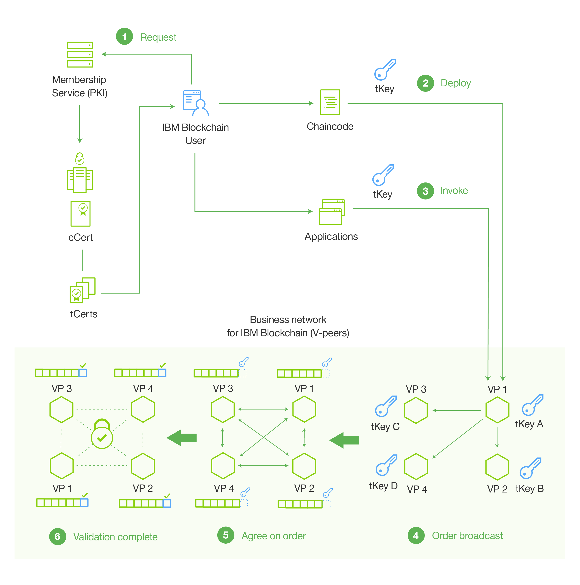

---

copyright:
years: 2016

---

{:new_window: target="_blank"}
{:shortdesc: .shortdesc}
{:codeblock: .codeblock}
{:screen: .screen}
{:pre: .pre}

# Network landscape
{: #etn_overview}
Last updated: 03 November 2016
{: .last-updated}

The IBM Blockchain on Bluemix Starter Developer plan and High Security Business Network plan exploit the latest iterations of Hyperledger Fabric v0.6, the Practical Byzantine Fault Tolerance (PBFT) consensus protocol, and the Hyperledger Fabric Client (HFC) SDK for Node.js. Both plans consist of four network nodes and a Certificate Authority. The Certificate Authority governs "Membership Services", which manages identities, network permissions and confidential transactions, through the issuance of digital certificates.
{:shortdesc}

The following blockchain capabilities are available in both plans:

* The PBFT consensus protocol manages the ordering of all transactions written to the shared ledger. A PBFT blockchain network of four nodes is able to reach consensus despite one Byzantine (faulty) node. For PBFT consensus testing details, see [Testing consensus and availability](etn_pbft.html).
* The HFC SDK for Node.js allows client-side Node.js applications to interact with the blockchain network. Client-side apps can securely enroll users via Membership Services, issue transactions and cryptographically exchange assets through the usage of tCerts. For more information about Membership Services and user privacy, see the [HFC SDK for Node.js](etn_sdk.html) section and the Hyperledger Fabric [Protocol Specification](https://github.com/hyperledger/fabric/blob/v0.6/docs/protocol-spec.md).
* You can access details about your blockchain network environment through the [Bluemix Monitor Dashboard](ibmblockchainmonitor.html).  

 
## Terminology

The following terminology, along with the subsequent diagram, contextualize the components of an IBM Blockchain network:

* Member - An identity for participating in the blockchain network. There are different classes of members, including users, peers, validators and auditors.
* Membership services - Services related to obtaining and managing member identities. Membership services is governed by the Certificate Authorities.  
* Registration - The act of adding a new member identity to the network. A member can be dynamically added to the network by a user with 'registrar' privilege. Members are also assigned roles and attributes, which control their access and authority on the network. Neither roles nor attributes can be assigned dynamically; you must instead edit the membersrvc.yaml file.
* Enrollment - Completes the registration process by allowing the new member to access the blockchain network. Enrollment can be done by the new member after obtaining a secret from a registrar (out-of-band), or by a middle-man with delegated authority to act on behalf of the new member.  

 
## Network architecture

Figure 1, and its subsequent description, depict IBM Blockchain network architecture, and the data flow for member services, transactions, consensus and appending to the ledger:

Figure 1.

The following steps describe the network flow from Figure 1 in detail:

1. A registered user enrolls with the network through the PKI (Membership Services) and receives a long-term enrollment certificate (eCert) and a batch of transaction certificates (tCerts).
2. The user deploys chaincode to the network. The chaincode (smart contract) encodes business logic, or rules, governing a specific type of transaction. Each transaction (deploy, invoke or query) requires a unique tCert, and must be signed with the user's private key. The user derives their private key from the assigned tCerts.
3. The user invokes the smart contract, which triggers the contract to self-execute its encoded logic.
4. A transaction is submitted to a network peer. Once the peer receives the transaction request, it submits the request to the network's primary peer (VP1 in Figure 1). The primary peer will order a block of transactions and broadcast this order to its fellow peers.
5. Peers use the network consensus protocol (PBFT) to agree upon the order of submitted transactions. This process of collectively ordering transactions is known as consensus.  
6. Once the peers have reached consensus, the transaction requests are executed and the block is appended to the shared ledger.  

<!---Both the developer and high-security networks unlock several features in the Hyperledger fabric which robustly enhance security, confidentiality and privacy.  The only fundamental difference between the two is their operating/hosting environment.  The developer network runs in a shared multi-tenant environment on Softlayer, whereas the high-security network exists as an isolated single-tenant running in a secure services container.  Each network leverages the same capabilities from the fabric, including a PBFT consensus protocol and the enhanced Node.js SDK.~~

~~The High-Security business network runs in an isolated and highly secured environment, distinguishing it from other cloud-hosted offerings. The operating system, fabric, and nodes all exist in a secure services container (SSC), providing your enterprise with the security and impregnability that customers have come to expect from system Z technology.  The SSC delivers performance optimization in - peer to peer communication, availability, scalability, hardware encryption, tamper-proof crypto keys, and securely encrypted VMs.  See the [Secure Services Container](etn_ssc.html) section for more details on the security features provided through the SSC.  Additionally, the high security network unlocks numerous features of the Hyperledger fabric (unavailable in the developer service), which robustly enhance security, confidentiality and privacy.  The configuration is such that you are able to test and affirm these features.~~  
{:shortdesc}

~~The high security plan augments the developer plan by delivering several enhancements that help meet the security requirements and concerns of an enterprise-level participant:~~--->

<!---The environment (LinuxONE on z) consists of a four-peer network implementing PBFT with Membership Services enabled, running in an application container.  The application container protects blockchain software, chaincode, and data running within the system. The blockchain software within the secure boot can be signed, attested, and encrypted; and once installed in the application container, is tamper-resistant.  Root users of the platform and system administrators cannot access or see z secure container contents.  In addition, the LinuxOne on z provides you with FIPS compliance, high Evaluation Assurance Level protection, a highly auditable operating environment, and crypto optimization--->
