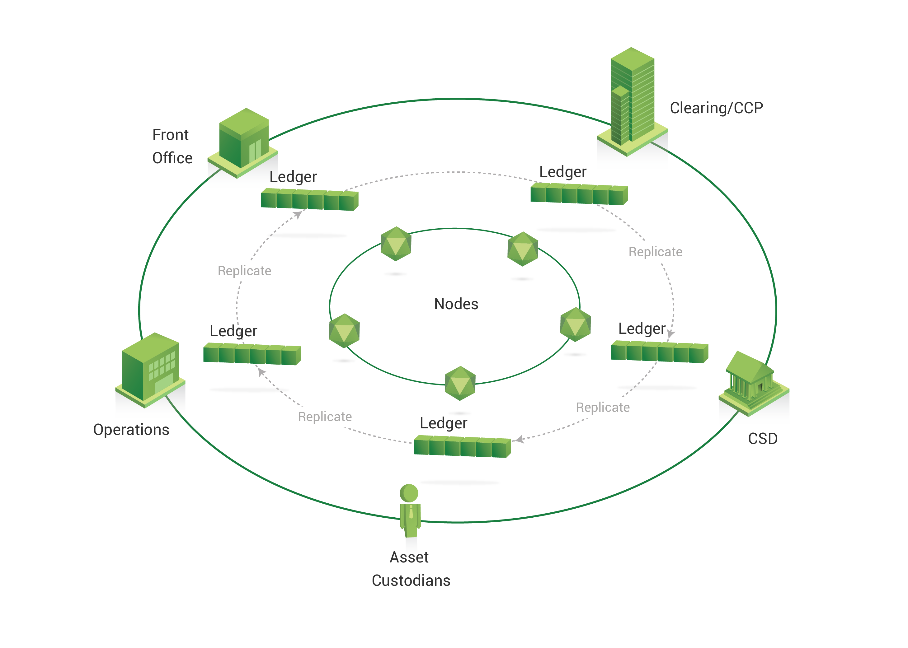
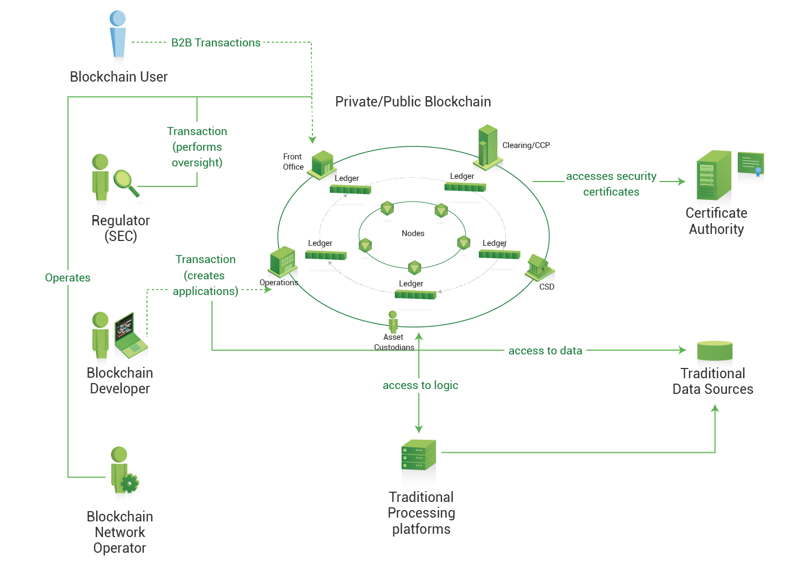

---

copyright:
  years: 2016

---

{:new_window: target="_blank"}
{:shortdesc: .shortdesc}
{:codeblock: .codeblock}
{:screen: .screen}
{:pre: .pre}

# About blockchain
{: #ibmblockchain_overview}
*Last updated: 28 April 2016*

You can use blockchain to create private and secure digital assets, which can then be traded quickly and securely over permissioned networks.
{:shortdesc}

## What is blockchain?
{: #what}

Blockchain is a technology for a new generation of transactional applications that establishes trust, accountability and transparency, while streamlining business processes. It is a design pattern made famous by bitcoin, but its practical uses extend far beyond cryptocurrency exchanges. With blockchain, we can reimagine the most fundamental business exchanges, and open the door to a new world of digital interactions.

Blockchain has the potential to vastly reduce the cost and complexity of cross-enterprise business processes. Its distributed ledger makes it easier to create cost-efficient business networks, where virtually anything of value can be tracked and traded, without requiring a central point of control. The application of this emerging technology is showing great promise across a broad range of business applications. For example, blockchain networks allow securities trades to be settled in minutes, instead of days. Blockchain can also help companies streamline the flow of goods and payments, and enable manufacturers to reduce product recalls by easily sharing production logs with OEMs and regulators.

## Key concepts
{: #keyconcepts}

Blockchain consists of a **business network**, over which members exchange assets, and a **shared ledger**, which is owned  equally and kept in sync by all members. Blockchain applications are pieces of chaincode that are deployed on the network to execute transactions. After validation by network peers, transactions are recorded to the shared ledger in blocks. Once recorded on the ledger, transactions can never be changed or deleted.

**Business network**: A blockchain network is characterized as follows:

- A decentralized peer-to-peer architecture, with nodes that represent network participants, such as banks and securities firms.
- A group of protocol peers which validates and commits transactions in order to reach consensus.

**Shared ledger**: The shared ledger can be thought of as the single source of truth for transactions on a blockchain network. And companies might have multiple shared ledgers: one for each of the business networks in which they participate. The shared ledger can be used for recording and totaling financial transactions. A shared ledger has the following attributes:
- It records all transactions across the business network.
- It is shared amongst all participants.
- It is replicated, so that each participant has their own copy.
- It is permissioned, so that participants can see only certain transactions.

Figure 1 depicts a shared ledger and its participants:

Figure 1.

## Key terms
{: #keyterms}
The following terms are instrumental in gaining a holistic understanding of blockchain concepts:

**Transaction**: A request to the blockchain to execute a function on the ledger. The function is implemented by a chaincode.  `Init`, `Invoke`, and `Query` are the three functions that implement chaincode.

**Transactor**: A network entity, such as a client application, that issues transactions.

**Ledger**: A sequence of cryptographically-linked blocks, containing transactions and the current world state.  In addition to data from previous transactions, the ledger (blockchain) also contains the data for currently-running chaincode applications.

**World state**: The collection of variables containing the results of executed transactions.

**Chaincode**: An application-level code (a.k.a. smart contract) stored on the ledger as a part of a transaction. Chaincode runs transactions that can modify the world state. A developer would generate a chaincode application and then deploy it to the network.

**Validating peer**: A network node that is responsible for running consensus, validating transactions and maintaining the ledger. When transactions are validated, they are appended to the ledger, in blocks. When a transaction fails validation, it  is purged from the block (not written to the ledger). A validating peer (VP) has the ability to deploy, invoke and query chaincode.

**Non-validating peer**: A network node that functions as a proxy, connecting transactors to validating peers. A non-validating peer (NVP) forwards invocation requests to its connected validating peer (VP). It also hosts the event stream server and the REST service. **Note:** The terms peer and node are often used interchangably when discussing blockchain technology.

**Permissioned ledger**: A blockchain network where each node is required to be a member of the network, and each node has access to only the transactions that its permissions allow.

## Network and application architecture
{: #architecture}

Figure 2 depicts an example blockchain network built upon a decentralized peer-to-peer architecture, with a Certificate Authority managing user roles and permissions for the network.

Figure 2.

Figure 3 represents the architecture of the core components in the blockchain fabric. Membership Services, Blockchain Services and Chaincode Services are logical structures, not a physical partitioning of components into separate processes, address spaces or virtual machines.

Figure 3.

**Membership services**: Membership services manage identity on the network. In a non-permissioned blockchain, participation does not require authorization, and all nodes can equally submit transactions and attempt to accumulate them into acceptable blocks; that is, there is no distinction of roles. Membership services combine elements of Public Key Infrastructure (PKI) and decentralization (consensus) to transform a non-permissioned blockchain into a permissioned blockchain.

A permissioned blockchain requires entities to register for long-term identity credentials (enrollment certificates), and can be distinguished according to entity type. For users, credentials enable the Transaction Certificate Authority (TCA) to issue pseudonymous credentials; these transaction certificates are then used to authorize submitted transactions. Transaction certificates persist on the blockchain, and enable authorized auditors to cluster otherwise unlinkable transactions.

**Blockchain services**: Blockchain services manage the distributed ledger through a peer-to-peer protocol, built on HTTP/2. The data structures are highly optimized to provide the most efficient hash algorithm for maintaining the world state replication. The NoOps consensus method is currently used for the Bluemix service.

**Chaincode services**: Chaincode services provide a secured and lightweight method to sandbox chaincode execution on the validating nodes. The environment is a “locked down” and secured container, along with a set of signed base images containing secure OS and chaincode language, runtime and SDK layers for Go, Java and Node.js. Additional languages can be enabled, if required.

Refer to the [protocol specification](https://github.com/hyperledger/fabric/blob/master/docs/protocol-spec.md#fabric) for the Hyperledger Project to learn more about the blockchain and its various components.
